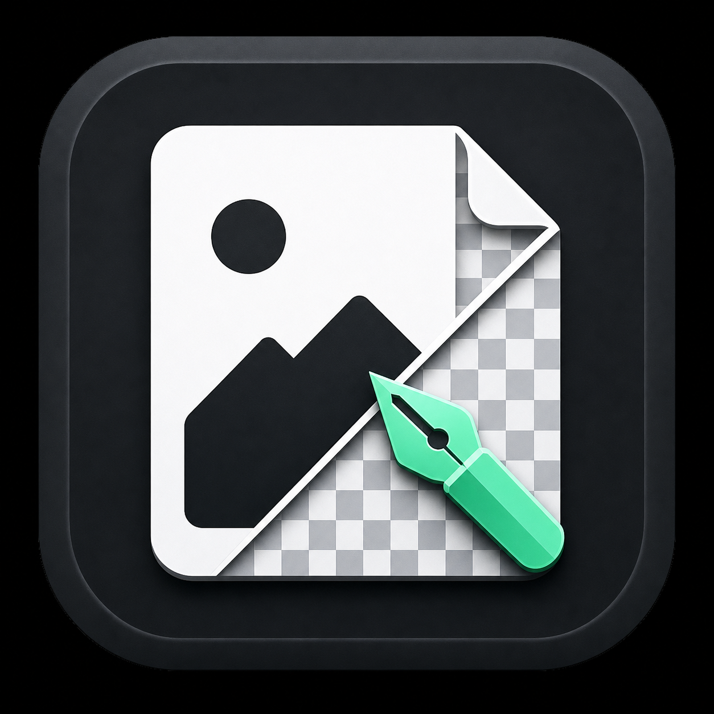

# PNG Factory

PNG Factory 是一套 Windows 桌面去背與遮罩精修工具。它先使用 AI 建立透明背景，再讓使用者透過擦除、還原與智慧精修調整主體邊緣。

<p align="center">
  
</p>

## 下載 Windows 版

[**下載最新版 PngFactory.exe**](https://github.com/kazory1115/png-factory/releases/latest/download/PngFactory.exe)

> 程式目前未購買 Windows 程式碼簽章。Windows SmartScreen 第一次開啟時可能顯示警告，請確認下載來源是本 repository 的 Releases 頁面。

## 功能

- JPG、JPEG、PNG 圖片載入與即時預覽
- `rembg` AI 自動去背
- 擦除背景與還原主體筆刷
- 可調整筆刷大小與硬度
- GrabCut 使用者引導式智慧精修
- 畫布縮放、平移與透明棋盤預覽
- 復原、重設遮罩及透明 PNG 輸出
- 深色圓角桌面工作台

## 使用方式

1. 選擇一張圖片。
2. 點擊「執行去背」。
3. 使用「擦除背景」或「還原主體」標記需要調整的位置。
4. 視需要點擊「智慧精修」，讓程式依照標記重新計算邊界。
5. 點擊「儲存透明 PNG」。

第一次執行 AI 去背時，`rembg` 可能需要下載模型檔，因此建議保持網路連線。

## 本機開發

需求：Python 3.10 以上、Windows 10/11 64-bit。

```bat
py -m venv .venv
.venv\Scripts\activate
py -m pip install -r requirements.txt
py main.py
```

## 建置 EXE

```bat
build_exe.bat
```

完成後的程式位於：

```text
dist\PngFactory.exe
```

## 發布版本

GitHub Actions 支援手動建置；推送 `v` 開頭的 tag 時，會自動建立 GitHub Release 並上傳 EXE。

```bash
git tag v1.0.0
git push origin v1.0.0
```

Release 建立後，README 上方的下載連結會自動指向最新版本。

## 專案結構

```text
png-factory/
├─ app/
│  ├─ editor.py       # 遮罩筆刷、復原與 GrabCut 精修
│  ├─ file_service.py # 檔案驗證與輸出命名
│  ├─ remover.py      # rembg 與去背邊緣後處理
│  └─ ui.py           # CustomTkinter 桌面介面
├─ assets/            # 程式 icon
├─ main.py            # 程式入口
├─ build_exe.bat      # Windows 建置腳本
└─ requirements.txt
```

